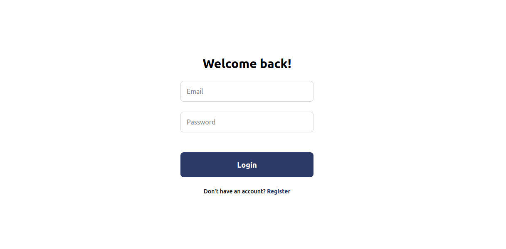

# 📚 Full-Stack Intern Assignment

## 🎯 Objective

Build a full-stack web application using **React + TypeScript** for the frontend and **Node.js + Prisma + TypeScript** for the backend. The UI must follow the provided **Figma design** closely and adhere to modern development best practices.

## Live Demo

You can view the live version of the application at:

[Live URL](https://authdemo-lyart.vercel.app/)

---

## Screenshots



## 📁 Project Structure

intellisqr-assignment/

│── backend/

│── frontend/

│── README.md

---

## 🚀 Tech Stack Overview

### 🖥️ Frontend

- **React + TypeScript**
- **React Hook Form** (Form handling)
- **React Query** (Data fetching and caching)
- **Zod** (Validation)
- **Vite**

### 🛠️ Backend

- **Node.js + Express**
- **TypeScript**
- **Prisma** (ORM)
- **PostgreSQL**

---

## 🧩 Frontend Overview

### 📐 Figma Design Conversion

- Convert provided Figma link into a fully responsive and pixel-perfect UI using modular components.

### 🧪 Features

- ✅ Typed API responses
- ✅ Zod-based schema validation
- ✅ React Hook Form for form state/validation
- ✅ React Query for API state & caching
- ✅ Error boundaries and toast notifications for error handling

---

## ⚙️ Backend Overview

### 🧾 Prisma Schema

````prisma
model User {
  id        String @id @default(cuid())
  email     String @unique
  password  String
  createdAt DateTime @default(now())
  updatedAt DateTime @default(now()) @updatedAt
}


Follow the instructions below to set up the project locally.

### Prerequisites

Make sure you have the following installed:

- [Node.js](https://nodejs.org/) (v14.x or higher)
- [npm](https://www.npmjs.com/)

### Installation

#### 1. Clone the repository

```bash

git clone https://github.com/whogoodluck/intellisqr-assignment

cd intellisqr-assignment

````

#### 2. Setup the backend (server)

```bash

cd backend 

npm install

```

#### 3. Configure environment variables

- Create a `.env` file inside the `backend/` folder

- Add the following:

  ```env

  PORT = 3001

  JWT_SECRET = <secretkey>

  POSTGRES_URL = <your-db-url>

  ```

#### 4. Start the backend server

```bash

npm run dev

```

The backend will run on `http://localhost:3001`

#### 5. Setup the frontend (client)

```bash

cd ../frontend

npm install

```

#### 3. Configure environment variables

- Create a `.env` file inside the `frontend/` folder

- Add the following:

  ```env

  VITE_API_URL=http://localhost:3001

  ```

#### 6. Start the frontend server

```bash

npm run dev

```

The frontend will be available at `http://localhost:5173`
